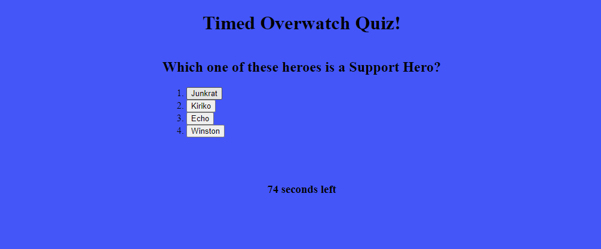

# timed-overwatch-quiz

## Description

This is a functional timed quiz based on the game Overwatch. The score used is the time left at the end of the quiz. You are deducted 15 secs from your time when answering a question wrong. It uses javascript to populate the page with elements while also adding contents and uses an event listener to begin the quiz. This also uses a setInterval function to time the quiz. Finally, it uses localStorage api to keep track of the scores and allows for a listing of a sorted high score list after inputting a score. This project was made so I can solidify concepts of using javascript to create and manipulate html like in the ways described earlier.

## Table of Contents

- README file
- index.html: the main page where the quiz takes place
- scores.html: the secondary page where the user inputs their name and then a high score list is shown
- script.js: the script for the main page which moves through questions while also verifying the answer and storing the score
- scores.js: the script for the secondary page which stores all total scores and presesnts the high scores
- style.css: a (very) simple stylesheet
- site-pic.png: a picture of the site during the quiz